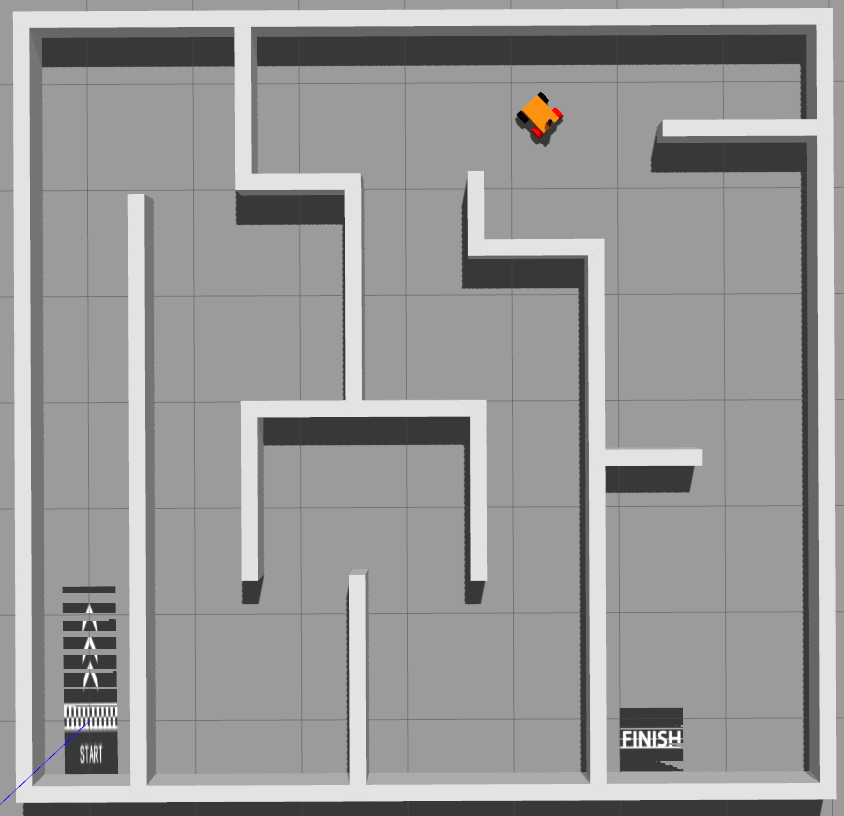
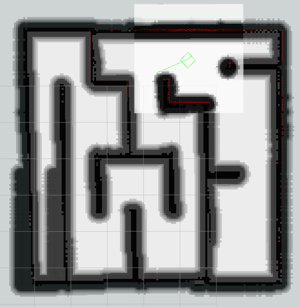

# 2D-Robot
## 该库实现了基于2D激光雷达和轮速计的机器人自主探索、建图、定位、导航、避障等功能。

，

**cmd_controller**
	一个键盘遥控器，能根据键盘输入，输出cmd_vel消息。
```
        rosrun cmd_controller cmd_controller_node
```
    
**gazebo_car-master**
	是一个小车的gazebo仿真，提供navigation所有通信接口

**my_robot_name_2dnav**
	导览机器人导航包的配置文件和启动文件。

**navigation**
	导航包
	知识点过多，参考以下链接
        参考链接：http://wiki.ros.org/navigation/Tutorials/RobotSetup

**ranger_ros-main**
	机器人底盘的ros包
```
            sudo modprobe gs_usb
            sudo ip link set can0 up type can bitrate 500000
            roslaunch ranger_base ranger_mini_v2.launch
```
固件刷新：参考用户手册
查看原始通信数据：
```
            sudo modprobe gs_usb
            sudo ip link set can0 up type can bitrate 500000
            candump can0
```
    
**realsense-ros**
    暂时弃用，改用D455_ros

**robot_voice**
	能将字符串消息转语音文件并播放
```
            rosrun robot_voice robot_voice_node
```
订阅的消息话题:/robot/voice

**rplidar_ros**
	雷达驱动包
        参考链接：http://wiki.ros.org/rplidar
```
            roslaunch rplidar_ros rplidar_s2.launch
```
若提示USB权限不够：
```
            sudo chmod 666 /dev/ttyUSB0
```
    
**simulation_gazebo**
    仿真小车配套的navigation的配置文件和启动文件

**slam_gmapping-melodic-devel**
2D激光建图包
参考链接：https://wiki.ros.org/slam_gmapping/Tutorials/MappingFromLoggedData
启动2D激光雷达：
```
            roslaunch rplidar_ros rplidar_s2.launch
```
启动激光雷达滤波，降低采样率和滤掉：
```
            rosrun rplidar_ros low_lidar.py
```
启动小车，读取里程计信息：
```
            sudo modprobe gs_usb
            sudo ip link set can0 up type can bitrate 500000
            roslaunch ranger_base ranger_mini_v2.launch
```
启动建图节点：
```
            rosrun gmapping slam_gmapping
```
可选选项：scan:=you_scan_name _odom_frame:=you_odom_name

保存地图：
```
            rosrun map_server map_saver -f <map_name>
```


## 真实机器人启动流程:
```
    sudo modprobe gs_usb
    sudo ip link set can0 up type can bitrate 500000
    /home/hnu/hnu/robot/gz_robot/robot.sh
```
        
## 仿真机器人自主探索：
```
	roslaunch gazebo_pkg gazebo.launch
	rosrun gmapping slam_gmapping
	roslaunch my_robot_name_2dnav robot_navigation.launch
	roslaunch explore_lite explore.launch
	rviz -d gz_robot_rviz.rviz
```

## 仿真机器人建图后导航：
```
        roslaunch gazebo_pkg gazebo.launch
        roslaunch simulation_gazebo robot_navigation.launch
        rviz -d gz_robot_rviz.rviz
```
通过2D Nav Goal设置目标点
